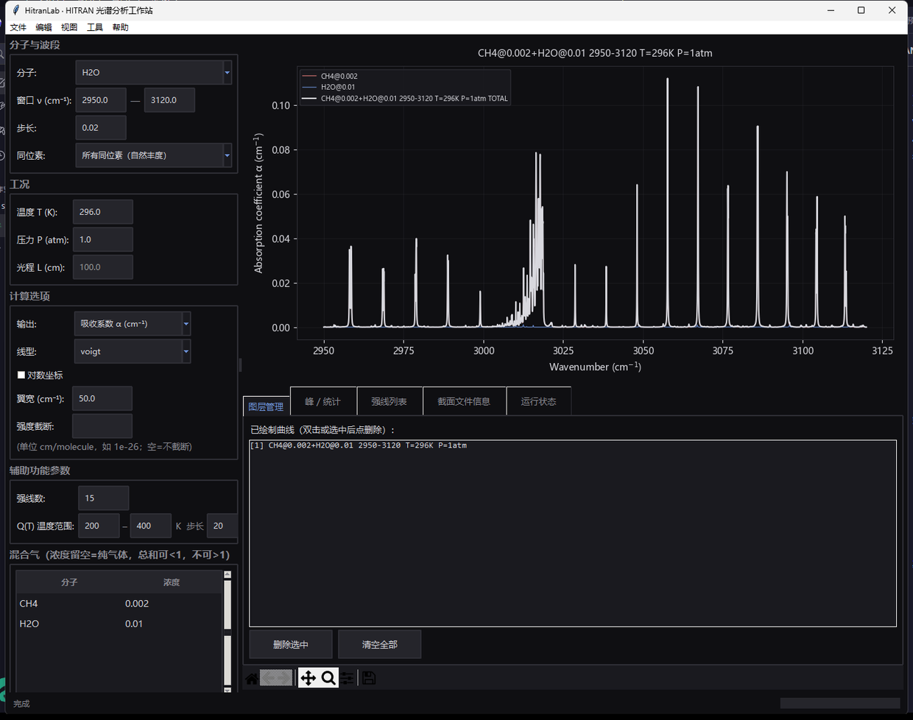
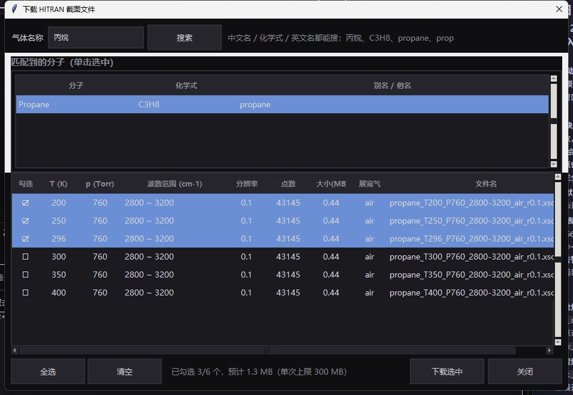

<div align="center">

<h1>hitran-mcp</h1>

<p><b>HITRAN 光谱数据库的 AI 工具链</b><br>
MCP 服务器 + HitranLab 桌面工作站 · 实时取数 · 本地缓存</p>

<a href="LICENSE"></a>
<a href="https://github.com/LKF0402/hitran-mcp/releases/latest"></a>
<a href="https://github.com/LKF0402/hitran-mcp/releases"></a>


</div>

[English](./README.en.md) | 中文

---

## 🚀 Quick Start / 快速开始

本项目提供两种使用方式，按需选择：

---

### Desktop GUI / 桌面图形界面

> 无需编程，适用于日常光谱分析

1. 前往 [Releases](https://github.com/LKF0402/hitran-mcp/releases) 下载最新版本 `HitranLab-windows-x64.zip`
2. 解压并运行 `HitranLab.exe`
3. 选择分子与参数，点击「计算并绘图」即可

---

### MCP Server / MCP 服务器

> 自然语言驱动，适用于 AI 助手与自动化工作流

将以下内容发送给您的 AI 助手（支持 MCP 协议的客户端均可）：

> "请帮我配置 HITRAN MCP 服务器，仓库地址：https://github.com/LKF0402/hitran-mcp"

配置完成后，可直接用自然语言描述计算需求：
> "帮我计算 CH₄ 在 2950-3100 cm⁻¹、296 K、1 atm 条件下的吸收谱"

---

*以下为详细技术文档，供深入使用时参考。*

## 效果预览

**HitranLab 桌面工作站** —— CH₄ + H₂O 混合气吸收谱（CH₄ 2000 ppm、H₂O 1%，296 K、1 atm）：



**截面库在线检索与一键下载** —— 按中文名模糊匹配分子、勾选 T/P 工况后批量下载：



## 目录

- [快速开始](#快速开始)
- [效果预览](#效果预览)
- [项目概览](#项目概览)
- [功能特性](#功能特性)
- [仓库结构](#仓库结构)
- [HitranLab 桌面工作站](#hitranlab-桌面工作站)
  - [下载与运行](#下载与运行)
  - [功能说明](#功能说明)
  - [从源码打包 / 发版](#从源码打包--发版)
- [快速开始（MCP 服务器）](#快速开始mcp-服务器)
  - [环境要求](#环境要求)
  - [安装](#安装)
  - [API Key（可选）](#api-key可选)
- [接入 AI 客户端](#接入-ai-客户端)
- [工具参考](#工具参考)
- [数据架构与分子覆盖](#数据架构与分子覆盖)
  - [逐线库（LBL）](#逐线库lbl)
  - [截面库（XSC）](#截面库xsc)
  - [双库桥接](#双库桥接)
- [使用规范](#使用规范)
- [自测](#自测)
- [常见问题](#常见问题)

## 项目概览

`hitran-mcp` 是 HITRAN 光谱数据库的完整工具链，包含两套前端：

1. **MCP 服务器**（`tools/hitran_mcp.py`）：stdio JSON-RPC 实现，AI 客户端可直接调用 12 个工具完成取数、谱计算、绘图与截面文件在线检索/下载。
2. **HitranLab 桌面工作站**（`app/hitran_app.py`）：Tkinter + matplotlib 图形界面，支持多组分吸收谱计算、叠加绘图、强线分析、配分函数查询、CSV/PNG 导出等，无需编程即可使用。

两套前端共用同一套物理计算引擎（`tools/hitran.py`），计算口径完全一致。

- **传输层**：MCP 服务器用 stdio JSON-RPC（协议 2024-11-05），纯 Python 标准库实现，无框架依赖。
- **数据源**：实时取自 HITRANonline。计算层用官方 HAPI 1.3.0.0；下载优先走官方 v2 API（HAPI2，URL 携带 API key），不可用时自动回退 HAPI 1.x 旧接口。物种表与同位素丰度直接读取 HAPI 官方 ISO 表，无硬编码白名单。
- **覆盖范围**：MCP 服务器 12 个工具覆盖 HITRAN2024 双库（逐线库 + 截面库）全链路；桌面工作站覆盖日常光谱分析全流程。
- **仓库边界**：仅含代码与文档；线表缓存（`Hitran_Data/`）、产物（`tmp/`）、按需下载的截面数据（`xsc_data/`）、打包产物（`dist/`/`build/`）与 API key 均属运行期数据，位于 `.gitignore` 区，不入库。

## 功能特性

| 特性 | 说明 |
|---|---|
| 全链路覆盖 | 物种查询 → 线表抓取 → 强线列表 → 吸收/透过率谱 → 谱图 → 配分函数 → 截面文件分析 |
| 双库桥接 | 逐线库走 HAPI 在线 API；截面库（600+ 重分子）走官方 API 在线检索 + 一键下载（免 Portal 登录），或读入本地文件，统一产物链路 |
| 物理防呆 | 混合气按 `α_i = x_i · α_pure_i(T, P, 浴气)`；窗口未覆盖自动重抓；0 线/失败显式报错，不静默出空谱 |
| 全程溯源 | 任何 CSV/PNG 均带 HITRAN2024 + HAPI + TIPS 版本水印，可追溯到原始文献 |
| 计算缓存 | 相同参数的谱计算结果自动缓存（200 条上限，LRU 淘汰），重复计算瞬时返回 |
| 桌面 GUI | HitranLab 工作站：多组分叠加绘图、图层管理、强线列表（标注分子来源）、Q(T) 曲线、波长↔波数换算器、截面文件在线搜索与下载、CSV/PNG 导出 |
| 零数据入库 | 缓存、产物、个人下载的截面文件、打包产物全部 gitignore，仓库保持轻量 |

## 仓库结构

```
hitran-mcp/
├─ README.md                 # 中文文档（本文件）
├─ README.en.md              # English documentation
├─ docs/images/              # README 配图（界面截图）
├─ CHANGELOG.md              # 更新日志
├─ LICENSE                   # GPLv3 协议
├─ requirements.txt          # Python 依赖
├─ mcp.config.example.json   # MCP 客户端注册片段（改路径后合入你的配置）
├─ app/
│  ├─ hitran_app.py          # HitranLab 桌面工作站（Tkinter + matplotlib GUI）
│  └─ hitranlab.ico          # 应用图标
└─ tools/
   ├─ hitran_mcp.py          # MCP 服务器本体（stdio JSON-RPC，纯标准库）
   ├─ hitran.py              # 官方 HAPI 的统一薄封装（输入护栏 + 溯源水印 + 计算缓存）
   └─ __init__.py
```

运行期自动生成（可随时删除，由工具重生）：

- `Hitran_Data/` — 线表缓存
- `tmp/mcp_out/` — MCP 工具产物（CSV/PNG，自带溯源水印）
- `tmp/` — 桌面工作站临时文件与自测输出
- `xsc_data/` — 用户按需下载的截面文件（个人数据，不入库）
- `dist/` / `build/` — PyInstaller 打包产物（不入库）

## HitranLab 桌面工作站

HitranLab 是无需编程的光谱分析桌面应用，适合日常科研使用。

### 下载与运行

**方式一：下载预编译版本（推荐）**

1. 前往 [GitHub Releases](https://github.com/LKF0402/hitran-mcp/releases) 下载最新版本的 `HitranLab-windows-x64.zip`
2. 解压到任意目录（路径建议不含中文和空格）
3. 双击 `HitranLab.exe` 即可运行

> 首次运行时会自动在程序同目录创建 `Hitran_Data/` 缓存目录，计算过的线表会自动缓存，下次无需重新下载。

**方式二：从源码运行**

```bash
git clone https://github.com/LKF0402/hitran-mcp.git
cd hitran-mcp
pip install -r requirements.txt
python app/hitran_app.py
```

### 功能说明

| 功能模块 | 说明 |
|---|---|
| 谱计算 | 支持吸收系数 α、截面 σ、线强 S(296K)、透过率 T 四种输出模式 |
| 多组分叠加 | 默认叠加绘图，可叠加多个分子/不同工况的谱线，图层可单独删除 |
| 强线列表 | 显示窗口内最强 N 条谱线（ν、S、γ_air、E″），多分子合并时标注每条线来源分子 |
| Q(T) 曲线 | 配分函数随温度变化曲线，用于评估温度对线强的影响 |
| 配分函数 | 查询指定温度下的 Q(T) 值（TIPS-2025） |
| 截面文件 | 在线按中文名/化学式检索截面分子并一键下载（免 Portal 登录），读入原生 .xsc / 两列 .txt，绘图并导出溯源 CSV |
| 换算工具 | 波长 ↔ 波数实时换算器 |
| 分子表查询 | HITRAN 官方 61 种逐线分子表查询 |
| 数据导出 | 谱图 PNG（300 DPI）、谱数据 CSV（带溯源水印）、完整线表 CSV |
| 计算缓存 | 相同参数计算结果自动缓存，重复计算瞬时返回 |

**操作流程**：
1. 选择分子（可多选混合气）、波数窗口、温度、压力、步长
2. 选择输出模式（吸收系数/截面/线强/透过率）
3. 点击「计算并绘图」
4. 可继续调整参数再次计算，谱线会自动叠加到同一画布
5. 点击「清空图」重置画布，点击「导出 CSV/PNG」保存结果

### 从源码打包 / 发版

**推荐使用一键发布脚本** —— 它把"打包 exe"与"生成 zip 资产"绑成一步，并自动校验一致性：

```bash
pip install pyinstaller
python tools/build_release.py
```

脚本按顺序完成：

1. 依据 `HitranLab.spec` 打包 exe；
2. 替换 `dist/HitranLab/`（**保留** exe 侧的线表缓存与 `hitran_api_key.txt`）；
3. 对打包产物跑一次无界面自检（分子数 / 谱点数 / 峰值 / 下载引擎）；
4. 生成 GitHub release 资产 `dist/HitranLab-windows-x64.zip`；
5. **校验 zip 内的 exe 与 `dist/HitranLab/HitranLab.exe` 的大小与 CRC32 完全一致**
   —— 不一致直接报错退出。这样就不会再出现"zip 忘了重建、用户下载到旧版本"的问题。

可选参数：

```bash
python tools/build_release.py --zip-only      # 只重建 zip（沿用现有 dist）
python tools/build_release.py --no-selftest   # 跳过打包后的自检
```

打包目录约 245 MB（one-dir 模式，含 HAPI2 / sqlalchemy / numba / llvmlite），压缩后 zip 约 100 MB。发布时上传第 4 步生成的 zip 作为 release 资产即可。

> 打包前请关闭所有正在运行的 HitranLab 窗口，否则会因文件锁定失败（脚本会给出明确提示）。
>
> **不要手写 `pyinstaller` 命令**：`HitranLab.spec` 中包含 HAPI2 / sqlalchemy / numba /
> llvmlite / pyparsing 等必需依赖，手写参数极易漏掉，导致打包版 HAPI2 不可用。

## 快速开始（MCP 服务器）

### 环境要求

- Python ≥ 3.10
- 依赖：`hitran-api`（官方 HAPI）、`numpy`、`matplotlib`（仅绘图/计算时惰性加载）

### 安装

```bash
git clone https://github.com/LKF0402/hitran-mcp.git
pip install -r hitran-mcp/requirements.txt
```

或将仓库置于任意固定路径（下文以 `D:\hitran-mcp\` 为例）。

### API Key（可选）

**桌面 GUI**：HitranLab → 工具 → 配置 API key → 输入并保存（自动同步到 `Hitran_Data/hitran_api_key.txt` 和 HAPI2 `config.json`）。

**命令行/MCP**：到 [hitran.org](https://hitran.org) 注册账号获取 API key，写入 `tools/hitran_api_key.txt`（与 `hitran_mcp.py` 同目录），或设置环境变量 `HITRAN_API_KEY`。

> 说明：配置 key 后，线表下载走 HITRAN 官方 v2 API（URL 携带 key），截面文件清单（`/api/v2/<key>/cross-sections`）与下载也需要它；未配置时自动回退 HAPI 1.x 旧接口（该接口不校验 key）。官方对 fetch 有每日配额，超限返回 403；本工具自动复用缓存，不重复下载。

## 接入 AI 客户端

任意支持 MCP 协议的客户端均可。将 `mcp.config.example.json` 的内容合入客户端配置（通常位于设置中的 MCP/工具管理），并**替换为你的实际路径**：

```json
"hitran": {
  "command": "python",
  "args": ["D:/hitran-mcp/tools/hitran_mcp.py"],
  "type": "stdio",
  "timeout": 600000,
  "disabled": false
}
```

> Windows 下若 `python` 不在 PATH，`command` 请使用解释器的完整路径（正斜杠或双反斜杠均可）。

保存后重启客户端，看到 `hitran` 服务器与 12 个工具即接入成功。

## 工具参考

| 工具 | 用途 | 关键输入 |
|---|---|---|
| `hitran_species` | 官方分子表：分子号 M、主同位素、各同位素自然丰度与质量 | `name`（分子式或分子号，省略返回全表） |
| `hitran_fetch` | 抓取波数窗口线表到本地缓存；未覆盖窗口自动重抓 | `name`, `numin`, `numax`, `iso` |
| `hitran_lines` | 窗口内最强 N 条线（ν、S、γ_air、E″），选线/干扰分析 | `name`, `numin`, `numax`, `top_n` |
| `hitran_spectrum` | 吸收系数 α / 透过率谱，CSV 带溯源水印；多物种可用 `specs_csv` 一次叠加 | `specs_csv` 或 `name`；`numin`, `numax` 必填 |
| `hitran_plot` | 谱图 PNG（多物种叠加 + 总谱，`ylog` 可选） | 同 `hitran_spectrum`，另加 `title/ylog/dpi` |
| `hitran_partition_sum` | 配分函数 Q(T)，TIPS 2025/2021/2017/2011 可选 | `name` 或 `M`；`T` |
| `hitran_cross_section` | 读入本地截面文件（原生 `.xsc` 或 ν–σ 两列）→ 截窗/绘图/溯源 CSV | `file_path`（缺省时列出 `xsc_data/` 可用文件） |
| `hitran_xsc_search` | 在线探测截面子库分子的截面文件清单（免登录只读，无文件名） | `name`（Portal 显示名） |
| `hitran_xsc_molecules` | 截面分子检索：中文名/化学式/英文名/俗名模糊匹配，返回候选与 `id`（约 670 个分子） | `query`（留空列全部）；`limit` |
| `hitran_xsc_files` | 列出某截面分子**可直接下载**的文件清单（T/P/波数范围/分辨率/点数/体积估算/filename，需 API key） | `name` 或 `molecule_id`；`include_all` |
| `hitran_xsc_download` | 选定文件下载到 `xsc_data/`（官方 API + 公开数据路径，免 Portal 登录，默认上限 300 MB） | `name`, `filenames`/`ids`；`dry_run`, `overwrite`, `max_total_mb` |
| `hitran_apikey_status` | API key / 缓存 / 产物 / 截面文件状态速查 | — |

多物种叠加示例（`specs_csv`，与 `name` 互斥）：

```
hitran_spectrum(specs_csv="CH4:0.01,C2H6:1e-5", numin=2950, numax=3120, T=296, P=1.0)
```

## 数据架构与分子覆盖

HITRAN2024 采用**双库分发架构**，两条数据通道的访问机制不同——这也是"某物种在逐线工具中查不到"的根因。

### 逐线库（LBL）

- 覆盖 **61 种分子**（H₂O / CO₂ / CH₄ / C₂H₆ / N₂O…）及 130+ 同位素体，数据为**逐跃迁线参数**（ν, S, γ_air, E″…）。
- 存储于 HITRANonline 关系型数据库，经官方 **HAPI**（HITRAN Application Programming Interface，Kochanov et al., JQSRT 177, 15–30, 2016）**在线 API** 提供——对应本 MCP 的 `hitran_fetch / lines / spectrum / plot` 通道：实时取数、本地缓存、可复现。

### 截面库（XSC）

- 覆盖 **600+ 重分子**（烷烃、VOC、制冷剂等）：多为稠密振动带结构、缺乏逐线验证参数，以**测量光谱文件**收录——原生 `.xsc`（1 行定宽头 + σ 序列，单位 cm²/molecule）或两列 ν–σ 文本（单位 cm⁻¹ / cm²·molecule⁻¹）。
- 访问机制：官方 v2 API（`/api/v2/<key>/cross-sections`）提供**文件清单**，公开数据路径 `/data/xsec/` 提供**文件本体**，二者均可直接访问、**无需登录 Web Portal**（需本机配置 HITRAN API key）。HAPI 1.x 侧仅提供 `read_hotw()` 本地读文件接口。

### 双库桥接

- 逐线通道（逐跃迁参数）与截面通道（测量光谱）是两套数据结构，HITRAN 官方分开分发；本工具把它们统一到同一条产物链路。
- **一键下载（推荐，免 Portal 登录）**：
  1. `hitran_xsc_molecules(query="丙烷")` 检索分子并拿到 `id`（支持中文名/化学式/英文名/俗名）；
  2. `hitran_xsc_files(molecule_id=<id>)` 列出可直接下载的文件（T/P/波数范围/点数/体积）；
  3. `hitran_xsc_download(name=..., filenames=[...])` 下载到 `xsc_data/`（gitignore，不入库；默认上限 300 MB）；
  4. `hitran_cross_section(file_path=...)` 读入，完成截窗、绘图、溯源 CSV 导出，与逐线谱共用 `tmp/mcp_out/` 产物链路。
- **手动下载（无 API key 时）**：`hitran_xsc_search(name=...)` 免登录探测清单 → 至 hitran.org/xsc 下载文件放入 `xsc_data/` → `hitran_cross_section` 读入。
- 逐线工具遇到截面库收录的分子时，报错信息会显式提示该架构差异与正确路径。

## 使用规范

1. **单位**：默认返回吸收系数 α（cm⁻¹）；`hitran_units=true` 返回截面 σ（cm²/molecule，不按摩尔分数缩放）。
2. **混合气**：按 `α_i = x_i · α_pure_i(T, P, 浴气)` 计算，不使用 `x·P` 作为分压；未提供浓度时按纯气体计算并提示确认。
3. **参数澄清**：未给出参数使用默认值并如实列出（`needs_confirm=true` 时需向用户复核 T/P/窗口/浓度）；`strict=true` 时 T/P 缺失直接报错。
4. **线型**：`profile` 可选 voigt（默认）/ lorentz / gauss / doppler / ht / sdvoigt，全部直调官方 HAPI 谱函数。
5. **溯源**：任何 CSV/图均可追溯至 HITRAN2024（Gordon et al., JQSRT 2026, doi:10.1016/j.jqsrt.2026.109807）+ HAPI（Kochanov et al., JQSRT 2016）+ TIPS 版本；论文引用以返回的 citation 字段为准。
6. **同位素口径**：默认主同位素（纯气体权重 1.0）；`iso="all"` 按官方自然丰度加权。

## 自测

**MCP 服务器自测**：

```bash
python tools/hitran_mcp.py --selftest
```

走真实网络抓取 CO 小窗口并出图，另含截面链路（合成文件）、在线探测与状态检查。

**桌面工作站自测**：

```bash
python app/hitran_app.py --selftest selftest.json
```

验证引擎 + 数据 + 网络在打包环境内完整可用，输出 JSON 含分子数、谱点数、峰值等信息。

## 常见问题

- **抓取失败 "daily limit"**：官方每日配额超限，次日重试；缓存未删时大部分窗口无需重新抓取。
- **修改代码不生效**：重启 AI 客户端（MCP 进程随客户端启动）；桌面工作站需重启程序。
- **清理缓存**：删除 `Hitran_Data/*.data|*.header` 即可，需要时自动重抓。
- **截面库分子（如丙烷 C₃H₈）查不到**：该分子属截面库，与逐线库分开分发。用 `hitran_xsc_molecules` 检索 → `hitran_xsc_files` 列清单 → `hitran_xsc_download` 一键下载，再用 `hitran_cross_section` 读入；无 API key 时可按[双库桥接](#双库桥接)流程手动下载。
- **exe 被杀软误报**：PyInstaller 打包的 Python 程序偶有误报，可添加信任或从源码运行。


## 免责声明

本软件按"现状"（AS IS）提供，作者不对使用本软件产生的任何直接或间接损失承担责任。

- 本软件仅供科研、教育和学习用途，不构成任何专业建议或产品承诺。
- 光谱计算结果基于 HITRAN 数据库和 HAPI 库，可能存在数据更新延迟、计算近似或误差。
- 用户应自行验证计算结果的准确性，关键应用场景请以官方数据和专业软件为准。
- 作者不保证软件无缺陷、不中断或满足特定需求。
- 使用本软件即表示您同意自行承担使用风险。

## 许可证

本项目采用 **GPLv3** 许可证，详见 [LICENSE](LICENSE)。

## References

- https://github.com/hitranonline/hapi
- https://github.com/hitranonline/hapi2
- https://github.com/hitranonline/hapiest
- https://hitran.org
